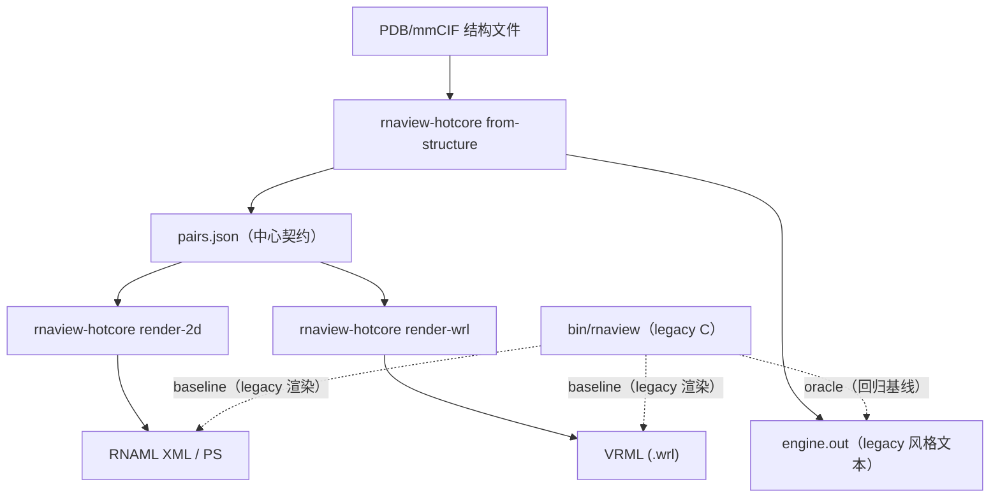

# RNAView（现代化版本）：Rust hotcore + Python 包（PyPI / Notebook）

这个仓库在保留 **legacy C 版 RNAView** 的同时，逐步把核心计算与渲染迁移到 **Rust**，并提供一个可在 Notebook 里直接 `import rnaview` 使用的 **Python 包**（面向 PyPI 分发）。

- 规格/契约口径（输入/输出/一致性）：`doc/spec.md`
- 交付/发布路线（Gate B/C/D + PyPI v0）：`doc/delivery-plan.md`
- 迁移评估与分层架构草案：`doc/python-port.md`

> 重要提示：本项目里 `legacy-v1` 语义强调 **兼容性（byte-exact）**；`science-v*` 语义用于 **科学修复**（差异用 Gate C allowlist 管控）。

从 RNAView 最早的工作（Leontis–Westhof 2001 + RNAView 2003）算起，距今已经二十多年（约 25 年）。近几年 RNA 结构与注释领域发展很快：mmCIF 成为主流格式，NMR/assembly/altloc/修饰核苷/大体系更常见，下游使用场景也从“单机命令行”扩展到“Notebook + 批处理 + 可复现 pipeline”。在现代化重构过程中，我们也暴露并固化了 legacy 代码里一些历史问题/边界行为（见本文的问题清单与 gate 文档）。随着新的 RNA 结构持续被解析，我们相信 RNAView 可以在保持兼容性的同时更进一步——因此这次升级从这里开始。

过去很长一段时间里，我们更常在 **三维几何空间** 里反复测量与归纳：氢键、距离/角度、堆叠与构象，试图总结“折叠规律”。但“规律”本身到底以什么形式存在（显式规则/公式？图结构？统计势？还是某种高维表示的几何？）并没有被充分讨论。近几年深度学习工具的出现提供了新的机会：模型可能把这些规律以 **权重/特征/embedding/隐空间几何** 的方式“存放”在神经网络里，让我们不只在 3D 坐标系中打转，而可以在更多维度上组织与比较结构。RNAView2.0 的现代化升级，一方面把 legacy 经验固化成可复现、可回归的结构化注释（`pairs.json`），另一方面把“兼容性”与“科学改进”分轨管理，目的是让它既能继续服务传统结构分析，也能更容易接入新的方法与下游 pipeline。

---

## 1) Notebook / PyPI 快速上手（推荐）

### 1.1 安装

#### A) 从 PyPI 安装（推荐）

```bash
pip install rnaview
```

当前 v0 计划提供平台专用 wheels：
- Linux x86_64
- macOS arm64（Apple Silicon）

这些 wheels 会内置 `rnaview-hotcore` 二进制；正常使用不需要安装 Rust toolchain。

支持的输入格式：
- PDB：`.pdb` / `.ent`
- mmCIF：`.cif`

其他平台可用两种方式：
- 使用CI 提供的 `rnaview-hotcore` 二进制，并设置 `RNAVIEW_HOTCORE=/path/to/rnaview-hotcore`
- 或从源码自行构建（见下文“开发者：从源码运行/回归/构建 wheel”）

#### B) 从仓库安装（开发/可编辑安装）

> 注意：从仓库 `pip install -e .` 默认只安装 Python 包壳（不会自动构建/下载 `rnaview-hotcore`）。你需要额外准备 hotcore（二进制路径见下方）。

```bash
git clone https://github.com/OOAAHH/RNAView.git
cd RNAView
python -m pip install -e .
```

构建并指定 hotcore（二选一）：

1) 用 Cargo 构建（需要 Rust toolchain）：

```bash
cargo build --release --manifest-path rust/Cargo.toml
export RNAVIEW_HOTCORE="$PWD/rust/target/release/rnaview-hotcore"
```

2) 直接构建一个“带 hotcore 的 wheel”并安装（v0 方案）：

```bash
bash tools/build_pypi_v0_wheel.sh
python -m pip install dist/*.whl
```

#### C) 直接从 Git URL 安装（可选）

同样需要你自行提供 `RNAVIEW_HOTCORE`：

```bash
python -m pip install "rnaview @ git+https://github.com/OOAAHH/RNAView.git"
```

### 1.2 最小示例：分析结构并得到 `pairs.json` + legacy `.out`

在 Notebook / Python REPL：

```python
import json
from pathlib import Path

import rnaview

input_path = "your.pdb"  # or "your.cif"
out_dir = Path("out/notebook_demo")
outputs = rnaview.analyze(
    input_path,
    out_dir=out_dir,
    formats=("pairs", "out"),
    semantics="legacy-v1",
)

print("pairs:", outputs.pairs_json)
print("out  :", outputs.out)

pairs = json.loads(outputs.pairs_json.read_text(encoding="utf-8"))
print("schema_version:", pairs["schema_version"])
bps = pairs["core"].get("base_pairs", [])
print("num_base_pairs:", len(bps))
for bp in bps[:5]:
    print(bp["i"], bp["j"], bp["kind"], bp.get("lw"), bp.get("orientation"), bp.get("note"))
```

在本仓库的 checkout 环境里，可以用 `test/pdb/test1/test1.pdb` / `test/pdb/tr0001/tr0001.pdb` / `test/mmcif/**.cif` 作为快速输入样例。

你会得到：
- `out/notebook_demo/pairs.json`：**权威结构化输出**（确定性序列化，可用于缓存/对比/下游消费）
- `out/notebook_demo/engine.out`：legacy 风格的 `.out(full)` 文本输出（用于兼容与回归）

### 1.3 生成 2D/3D 渲染产物（XML/PS/VRML）

```python
import rnaview

input_path = "your.pdb"  # or "your.cif"
outputs = rnaview.analyze(
    input_path,
    out_dir="out/notebook_render",
    formats=("pairs", "out", "xml", "ps", "wrl"),
    semantics="legacy-v1",
)

print(outputs.xml, outputs.ps, outputs.wrl)
```

> 说明：当前 v0 以 legacy RNAML(XML)/PS/VRML 为兼容目标（Gate D canonical diff‑0）。SVG/glTF 目前在仓库工具链里以“确定性转换器”的方式提供（见 `tools/rnaview_ps_svg.py`、`tools/rnaview_vrml_gltf.py`），后续会逐步下沉到 Python 包 API。

### 1.4 示例：mmCIF 输入

```python
import rnaview

outputs = rnaview.analyze(
    "your.cif",
    out_dir="out/notebook_mmcif",
    formats=("pairs", "out"),
    semantics="legacy-v1",
)
print(outputs.pairs_json, outputs.out)
```

### 1.5 更底层的 API（可控输出路径）

当你想自定义输出文件名/路径时，可以用 `rnaview.api`：

```python
from rnaview.api import from_structure, render_2d, render_wrl

input_path = "your.pdb"  # or "your.cif"
from_structure(
    input_path,
    out_pairs_json="out/manual/pairs.json",
    out_out="out/manual/engine.out",
    semantics="legacy-v1",
)

render_2d(
    "out/manual/pairs.json",
    source_path=input_path,
    out_xml="out/manual/test1.xml",
    out_ps="out/manual/test1.ps",
)

render_wrl(
    "out/manual/pairs.json",
    source_path=input_path,
    out_wrl="out/manual/test1.wrl",
)
```

### 1.6 示例：`legacy-v1` vs `science-v1`

`legacy-v1` 用于 byte-exact 兼容；`science-v1` 用于受控的科学修复（差异进入 Gate C allowlist）。

```python
import json

import rnaview

inp = "your.cif"  # mmCIF 更容易触发 legacy/science 的差异

o_legacy = rnaview.analyze(inp, out_dir="out/legacy", formats=("pairs", "out"), semantics="legacy-v1")
o_science = rnaview.analyze(inp, out_dir="out/science", formats=("pairs", "out"), semantics="science-v1")

p_legacy = json.loads(o_legacy.pairs_json.read_text(encoding="utf-8"))
p_science = json.loads(o_science.pairs_json.read_text(encoding="utf-8"))

print("legacy stats:", p_legacy["core"]["stats"])
print("science stats:", p_science["core"]["stats"])
```

### 1.7 Notebook 常见操作：把 `pairs.json` 变成 DataFrame

> 需要 `pandas`：`pip install pandas`

```python
import json
from pathlib import Path

import pandas as pd

pairs_path = Path("out/notebook_demo/pairs.json")
pairs = json.loads(pairs_path.read_text(encoding="utf-8"))
df = pd.DataFrame(pairs["core"]["base_pairs"])
df.head()
```

### 1.8 Notebook 常见操作：筛选某类碱基对

```python
import json
from pathlib import Path

pairs = json.loads(Path("out/notebook_demo/pairs.json").read_text(encoding="utf-8"))
bps = pairs["core"]["base_pairs"]

# 例：找所有 cis 的 LW 分类（lw/orientation 可能为 null，视 case 而定）
cis = [bp for bp in bps if bp.get("orientation") == "cis"]
print("num_cis:", len(cis))
print(cis[:3])
```

---

## 2) 这个项目里有哪几条“线”（实现路径/后端）？

本仓库同时存在多条路径，分别服务于：兼容性回归（oracle）、逐步替换、最终 No‑C 交付、以及性能/科学修复。

### 2.1 组件分层（你实际在用的东西）

1) **Legacy C（上游/基线）**：`bin/rnaview`
- 作用：作为回归 oracle；也是理解 legacy 行为的“唯一真相”。
- 特点：输出格式极其敏感（空格/浮点/顺序/header 等都可能影响 diff）。

2) **Rust Hotcore（二进制）**：`rnaview-hotcore`
- 作用：新实现的核心引擎（结构解析/配对计算/2D/3D 渲染）。
- 对外接口：命令行子命令（见 `rust/src/main.rs` 的 Usage）。

3) **Python 包（PyPI 交付形态）**：`rnaview`
- 作用：在 Notebook/批处理里通过 `import rnaview` 调用 hotcore（subprocess）。
- v0 wheel 会把 `rnaview-hotcore` 作为包内资源放在 `rnaview/_bin/`，并随包一起分发。

整体关系（简化）：



### 2.2 渲染回归（Gate D）里常见的 backend 名称

这些名字主要用于开发/回归工具（例如 `tools/rnaview_render.py --backend ...`）：

| backend | 计算（pairs/out） | 2D（XML/PS） | 3D（VRML） | 主要用途 |
|---|---|---|---|---|
| `legacy` | legacy C | legacy C | legacy C | baseline/oracle |
| `rustcore-release` | legacy/C pipeline + Rust hot fn（桥接） | legacy/C | legacy/C | 迁移期桥接（对齐 `.out`） |
| `pairs-out` | Rust（No‑C compute） | legacy/C（通过 `RNAVIEW_OUT_PATH` 注入 `.out`） | legacy/C | “新计算 + 旧渲染”过渡形态 |
| `pairs-out-noc3d` | Rust（No‑C compute） | legacy/C | Rust `render-wrl` | 先把 3D 彻底 No‑C |
| `pairs-out-noc` | Rust（No‑C compute） | Rust `render-2d` | Rust `render-wrl` | **最终 No‑C 渲染交付形态**（当前 CI/Gate D 使用） |

---

## 3) 输出文件与语义（你该读哪个？）

### 3.1 `pairs.json`（推荐作为下游接口）

`pairs.json` 是这个项目的“权威产物”，目标是：
- **确定性**：同一输入+同一 options ⇒ 可 byte-diff
- **结构化**：比 legacy `.out` 更适合下游消费/缓存/Notebook
- **可演进**：schema 版本化（未来可以安全扩字段）

当前 `schema_version=1` 的结构（简化）：

```text
{
  "schema_version": 1,
  "source": {"path": "...", "format": "pdb|cif", ...}?,
  "options": {...}?,
  "core": {
    "base_pairs": [ ... ],
    "multiplets": [ ... ],
    "stats": { ... }
  }
}
```

其中 `core.base_pairs[]` 的常用字段包括：
- `i`,`j`：base index（1-based，与 legacy `.out` 保持一致）
- `chain_i`,`resseq_i`,`base_i` 与 `base_j`,`resseq_j`,`chain_j`：legacy 风格的残基标识与碱基字母
- `kind`：`"pair" | "stacked" | "unknown"`
- `lw`,`orientation`：Leontis–Westhof 分类与 cis/trans（若适用）
- `note` / `text`：legacy 尾注或原始文本（用于兼容与回归）
- `out_index`：该记录在 legacy `BEGIN_base-pair` block 内的 1-based 行序（用于渲染端复刻 legacy 输出顺序）

### 3.2 legacy `.out(full)`（兼容/回归用）

legacy `.out` 是历史生态的兼容接口，Gate B 用它做 **byte-exact** 验收。

> 建议：Notebook 下游尽量不要直接解析 `.out`（更脆弱）；优先用 `pairs.json`。

---

## 4) 语义版本（semantics）：兼容 vs 科学修复

### 4.1 `legacy-v1`（兼容轨道）

目标：完全复刻 legacy 行为（包括某些“历史 bug/怪癖”），用于：
- Gate B：`.out(full)` byte-exact（No‑C）
- Gate D：渲染产物 canonical diff‑0（legacy golden）

当前 `legacy-v1` 明确包含这些兼容策略（见 `doc/spec.md`）：
- mmCIF 去氢：复刻 legacy mmCIF 去氢 bug（`legacy-mmcif-bug`）
- insertion code：缺失 insertion code 映射为 `?`（`legacy-question-mark`）
- chain id：链 ID 截断为 1 字符（`legacy-1char`，可能有碰撞风险）

### 4.2 `science-v1`（科学修复轨道）

目标：对明确的 legacy 缺陷做修复，但**不破坏** `legacy-v1` 的兼容 gate。

当前 `science-v1` 的第一项修复是：
- 修复 mmCIF 去氢 bug（对比 `legacy-v1` 会产生差异；差异由 Gate C allowlist 管控）

---

## 5) 重构过程中发现/固化的 legacy 问题清单（已记录/非穷尽）

下面这些点要么是明确 bug，要么是影响一致性的“历史行为细节”。它们会直接导致：
- 同一结构在 PDB vs mmCIF 输入下行为不同
- 同一输入在不同机器/环境下产生伪 diff
- 迁移/重写时出现“看似小，实则会炸 gate”的边界条件

截至目前（2026-02），已明确并在代码/文档中固化的点包括：

1) **mmCIF 去氢 bug（legacy）**
- legacy mmCIF 路径会错误地保留部分氢原子（典型是 4 字符原子名），影响几何判断与统计。
- `legacy-v1` 需要复刻该行为；`science-v1` 会修复并通过 Gate C 管控差异。

2) **mmCIF chain id 截断为 1 字符（legacy）**
- mmCIF 链 ID 可能是多字符；legacy 输出只保留 1 字符，可能引入碰撞与歧义。
- 当前 `legacy-v1/science-v1` 均保持该行为；后续会考虑引入 `unique-1char` 或更完整的链标识策略（必须走 Gate C）。

3) **mmCIF insertion code 缺失的表示（legacy）**
- legacy 会把缺失/`.` 的 insertion code 映射为 `?`，这会影响 residue id 的文本表示与兼容输出。

4) **PS/XML 渲染的“格式敏感性”**
- legacy RNAML/XML 与 PS 输出对空白/浮点格式/输出顺序极度敏感；任何微小差异都会导致 diff。
- Gate D 会对非确定 header 做 canonicalize；除此之外要求 diff‑0。

5) **`xml2ps.c` 的序号 label “缺口逻辑”**
- legacy `xml2ps.c` 在 `k1==99` 或 `k1==999` 时**不会输出**序号 label；Rust `render-2d` 已保持一致以收敛最后 3 个 byte diff case。

6) **NMR 多模型（代表模型选择）**
- legacy 会根据结构文件中的信息选择代表模型；选择策略会影响 base index 与配对结果。
- 该行为会作为“结构解析 policy”逐步显式化并纳入回归（避免不同实现/不同环境产生不一致）。

7) **altloc / 缺失原子 / 过滤策略的细节**
- altloc 取舍、去水/去 H/去 ANISOU、分辨率过滤等都会改变“进入核心计算的结构”，从而导致差异。
- 在重构里，这些会被收敛为可落盘的 policy（并通过 semantics + Gate C 控制科学修复）。

8) **mmCIF `auth` vs `label` 语义差异**
- legacy 提供 `--label` 切换；不同 scheme 会影响链/编号与最终输出。
- 当前 v0 以兼容为先（默认走 legacy 的 `auth` 口径）；后续会把该选择显式化并纳入契约与回归。

9) **`base_pair_statistics.out` 固定写入当前目录（legacy）**
- legacy 会无条件写 `base_pair_statistics.out` 到当前工作目录（全局文件名），并发跑库/Notebook 多进程时容易互相覆盖。
- 新 pipeline/包化交付尽量把所有产物都放进用户指定的 `out_dir/`，避免隐式全局写入。

10) **输入类型探测依赖“扫描文件内容”（legacy）**
- legacy 会通过扫描文件内容来判断输入是 PDB/mmCIF/RNAML，而不是严格依赖扩展名或显式参数。
- 在批处理/混合输入时可能导致误判；新 API 尽量显式指定 format（或用扩展名推断），并把选择写入 `pairs.json.options`。

> 我们不会把这些“兼容性风险点”当作隐藏知识：会持续把新发现记录进 `doc/spec.md` / `doc/python-port.md` / `doc/delivery-plan.md`，并用 gate 体系锁住。

---

## 6) 配置与排错

### 6.1 hotcore 二进制查找顺序

Python 包会按以下顺序找 `rnaview-hotcore`（见 `rnaview/_hotcore.py`）：

1. 环境变量：`RNAVIEW_HOTCORE=/path/to/rnaview-hotcore`
2. 包内自带：`rnaview/_bin/rnaview-hotcore`（仅支持 Linux x86_64 + macOS arm64）
3. PATH：`rnaview-hotcore` 在系统 PATH 中

示例（显式指定外部 hotcore）：

```bash
export RNAVIEW_HOTCORE="/abs/path/to/rnaview-hotcore"
python -c "import rnaview; rnaview.analyze('your.pdb', out_dir='out/quick', formats=('pairs','out'))"
```

### 6.2 `RNAVIEW` 环境变量

hotcore 与 legacy 都需要 `RNAVIEW` 指向“包含 `BASEPARS/` 的目录”。

- 使用 Python 包时：会自动把 `RNAVIEW` 指向包内的数据目录（一般无需关心）。
- 手动跑二进制时：需要自己设置 `RNAVIEW`。

### 6.3 常见报错

- `HotcoreNotFoundError: rnaview-hotcore not found`：说明没找到可执行的 hotcore。优先安装支持的平台 wheel；或设置 `RNAVIEW_HOTCORE=/abs/path/to/rnaview-hotcore`。
- `embedded rnaview-hotcore is only supported on ...`：说明你当前平台没有内置二进制；同样通过 `RNAVIEW_HOTCORE` 指向外部二进制解决。
- `OSError: [Errno 8] Exec format error`：通常表示找到了某个 `rnaview-hotcore`，但它是**其他平台/架构**的二进制（例如把 Linux 的 hotcore 放到了 macOS 环境）。删除遗留的 `rnaview/_bin/rnaview-hotcore` 并重新安装匹配平台的 wheel，或通过 `RNAVIEW_HOTCORE` 指向正确的二进制。

---

## 7) 开发者：从源码运行/回归/构建 wheel

### 7.1 Gate 与一键脚本

- Gate B（No‑C + `.out(full)` byte-exact）：`bash test_phase2_noc.sh`
- Gate C（science diff + allowlist）：`bash test_phase3_gate_c.sh`
- science-v1 冻结回归：`bash test_phase3_science.sh`
- Gate D（渲染 canonical diff‑0）：`bash test_phase4_gate_d.sh`
- Phase 3 一键收尾（Gate B + Gate C + science-v1，可附加 extra inputs）：`bash test_phase3_wrapup.sh`

### 7.2 直接运行 `rnaview-hotcore`（调试/开发）

```bash
cargo build --release --manifest-path rust/Cargo.toml
export RNAVIEW="$PWD"  # 让 hotcore 能定位 BASEPARS/*

rust/target/release/rnaview-hotcore from-structure test/pdb/test1/test1.pdb \
  --format pdb --oracle compute --semantics legacy-v1 \
  -o out/manual_cli/pairs.json --emit-out out/manual_cli/engine.out

rust/target/release/rnaview-hotcore render-2d out/manual_cli/pairs.json \
  --source test/pdb/test1/test1.pdb --out-xml out/manual_cli/test1.xml --out-ps out/manual_cli/test1.ps
```

### 7.3 构建 PyPI v0 wheel（本地）

```bash
bash tools/build_pypi_v0_wheel.sh
```

它会：
1) `cargo build --release` 构建 `rust/target/release/rnaview-hotcore`
2) 把二进制拷进 `rnaview/_bin/`
3) `pip wheel . -w dist --no-deps` 产出 wheel

### 7.4 CI：构建平台专用 wheels + 运行 smoke

- GitHub Actions 工作流：`.github/workflows/wheels.yml`
- 会在 Linux x86_64 + macOS arm64 上构建 wheel，并执行最小 smoke（安装 wheel → `import rnaview` → 跑一个 `analyze()`）

---

## 8) 背景与引用（Legacy RNAView）

RNAView 的原始工作（Leontis–Westhof 分类体系）可参考：

- Yang, H., Jossinet, F., Leontis, N., Chen, L., Westbrook, J., Berman, H. M., Westhof, E. (2003).
  *Tools for the automatic identification and classification of RNA base pairs.* Nucleic Acids Research 31(13): 3450–3460.
  https://doi.org/10.1093/nar/gkg529

- Leontis, N. B., Westhof, E. (2001).
  *Geometric nomenclature and classification of RNA base pairs.* RNA 7:499–512.
  https://doi.org/10.1017/s1355838201002515
